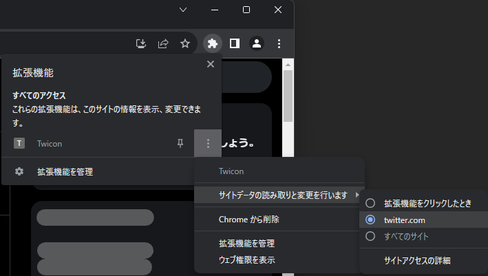
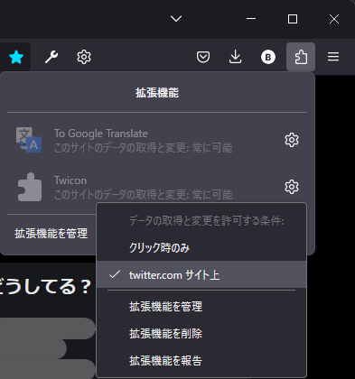

# twicon
TwitterのfaviconとアイコンをXから鳥に戻すやつ。

## 使用方法

1. ### ダウンロードしたファイルを解凍する

1. ### ブラウザに拡張機能を追加する


	<details>
	<summary>Chromeの場合</summary>
	
	1. アドレスバーに`chrome://extensions/`を入力して移動してください。
		```
		chrome://extensions/
		```
	1. デベロッパーモードをオンにし、`パッケージ化されていない拡張機能を読み込む`をクリック
	1. 展開したフォルダを開く
	
	</details>
	
	<details>
	<summary>Firefoxの場合</summary>
	
	1. アドレスバーに`about:debugging#/runtime/this-firefox`を入力して移動してください。
		```
		about:debugging#/runtime/this-firefox
		```
	1. `一時的な拡張機能`を展開し、`一時的なアドオンを読み込む`をクリック
    	1. 展開したフォルダ内の`manifest.json`を開く
	
	</details>

1. ### `twicon`がオンになっていることを確認
	* Chrome  
	

   	* Firefox  
	
